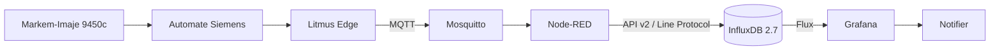

# GlassInk Monitor

Plateforme IIoT de surveillance conditionnelle d'une imprimante continue à jet
d'encre Markem-Imaje 9450c utilisée pour le marquage DMC de pare-brise.

Le projet collecte les données en sortie de Litmus Edge, les transporte par
MQTT, les transforme avec Node-RED, les historise dans InfluxDB et les présente
dans Grafana. Le raccordement industriel est en lecture seule : aucun composant
de la plateforme n'écrit dans l'automate ou dans l'imprimante.

## Objectifs

- connaître l'état de l'imprimante et du jet en temps réel ;
- suivre l'encre, l'additif, la viscosité, la pression et les températures ;
- anticiper l'épuisement et la péremption des consommables ;
- distinguer un arrêt réel d'une période sans commande client ;
- historiser les défauts, les temps d'arrêt et les résultats de marquage ;
- adapter les vues aux opérateurs, à la maintenance et à la direction.

## Architecture



Le simulateur remplace temporairement la sortie MQTT de Litmus Edge. Il publie
le même contrat JSON et permet de tester la chaîne complète sans connexion à la
ligne de production.

## Données Markem-Imaje 94xx simulées

Le modèle reprend les caractéristiques documentées pour l'imprimante 9450c du
site : cartouches externes de 800 mL, réservoirs internes de 1,075 L, états du
jet et de l'impression, vitesse moteur, pression, viscosité, températures,
niveaux, consommation d'additif et autonomie d'encre.

| Famille | Exemples |
|---|---|
| États | `printer_state_code`, `jet_status_code`, `printing_status_code`, `jet_running` |
| Fluides | `ink_level`, `solvent_level`, `ink_tank_level_mm`, `additive_tank_level_mm` |
| Procédé | `pressure_10mbar`, `viscosity_tenth_second`, `motor_speed_rpm` |
| Températures | `electronic_temperature`, `ink_temperature`, `head_temperature` |
| Maintenance | `filter_hours_remaining`, `pump_run_hours`, `total_additive_consumption_cc` |
| Production | `line_demanding`, `print_count`, événements de marquage DMC |

Les valeurs qui dépendent du montage réel, comme la hauteur utile du réservoir,
restent configurables dans `simulator/src/config.py`.

## Classification de l'activité

La production fonctionne 24 h/24, cinq jours par semaine, mais dépend des
commandes. La disponibilité n'est donc pas calculée sur le temps calendaire.

| Demande d'impression | Imprimante | Classification |
|---|---|---|
| oui | en marche | production |
| oui | arrêtée ou en défaut | arrêt réel |
| non | jet actif | attente, consommation d'additif |
| non | arrêtée | sans commande |

Seule la deuxième situation est comptée comme indisponibilité.

## Stockage InfluxDB

| Mesure | Contenu |
|---|---|
| `printer_telemetry` | mesures continues et indicateurs calculés |
| `printer_event` | changements d'état, défauts et consommables |
| `marking_event` | DMC, produit et résultat du contrôle |

Node-RED calcule aussi la consommation lissée, le temps avant épuisement, la
première échéance entre épuisement et péremption, ainsi que la classification
de l'activité. Les requêtes Flux de Grafana restent centrées sur le filtrage,
les fenêtres temporelles et les agrégations.

## Démarrage

Prérequis : Docker Desktop ou OrbStack avec Docker Compose.

```bash
make init       # crée .env à partir du modèle
# renseigner les secrets demandés dans .env
make demo       # construit et démarre les six services
make ps         # affiche leur état de santé
make verify     # exécute les tests et la validation bout en bout
```

| Service | Adresse locale |
|---|---|
| Grafana | <http://localhost:3000> |
| Node-RED | <http://localhost:1880> |
| InfluxDB | <http://localhost:8086> |
| Mosquitto | `localhost:1883` |
| Notifier | <http://localhost:8080/health> |

Commandes utiles :

```bash
make logs          # journaux des conteneurs
make influx        # contexte CLI InfluxDB
make reset-influx  # réinitialise les données de démonstration
make down          # arrête la plateforme
```

## Organisation du dépôt

```text
broker/       configuration MQTT Mosquitto
simulator/    modèle Python de l'imprimante CIJ
ingestion/    image, configuration et flux Node-RED
storage/      modèle et exploitation InfluxDB
dashboards/   provisioning Grafana, tableaux et alertes
notifier/     diffusion des alertes
rapport/      mémoire PFA en LaTeX et PDF final
```

## Validation

`make verify` contrôle le fichier Compose, les sources Python/JavaScript, les
règles physiques du simulateur, l'ingestion réelle par Node-RED, les 23 requêtes
des tableaux Grafana, les sept chaînes d'alertes et l'idempotence d'une
retransmission MQTT QoS 1 exacte.

## Raccordement à Litmus Edge

Le passage du simulateur à la ligne réelle demande un exemple de payload et la
liste des tags publiés par Litmus Edge. Le mapping est effectué dans le flux de
télémétrie Node-RED sans modifier InfluxDB ni les tableaux de bord. Les unités,
les codes d'état et la cadence de publication doivent être validés avec les
données de la 9450c installée.

Avant un déploiement industriel, activer TLS et les ACL MQTT, remplacer les
secrets de démonstration, définir la rétention InfluxDB, sauvegarder les volumes
et séparer les réseaux OT et supervision.

## Rapport

Le mémoire PFA compilé se trouve dans
`rapport/build/GlassInk-Monitor-Rapport-PFA.pdf`.
